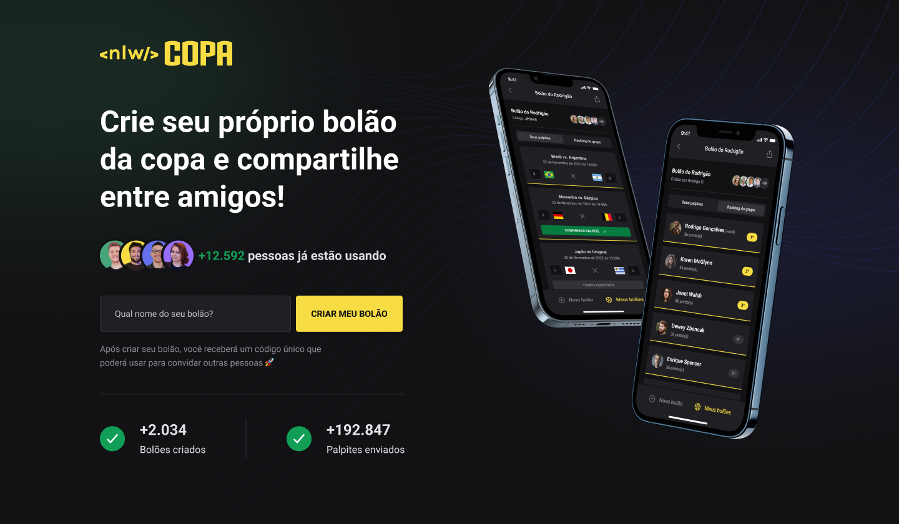
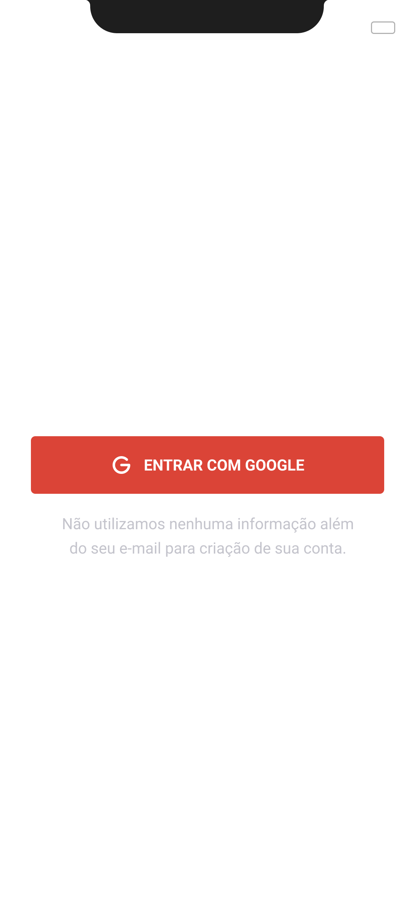
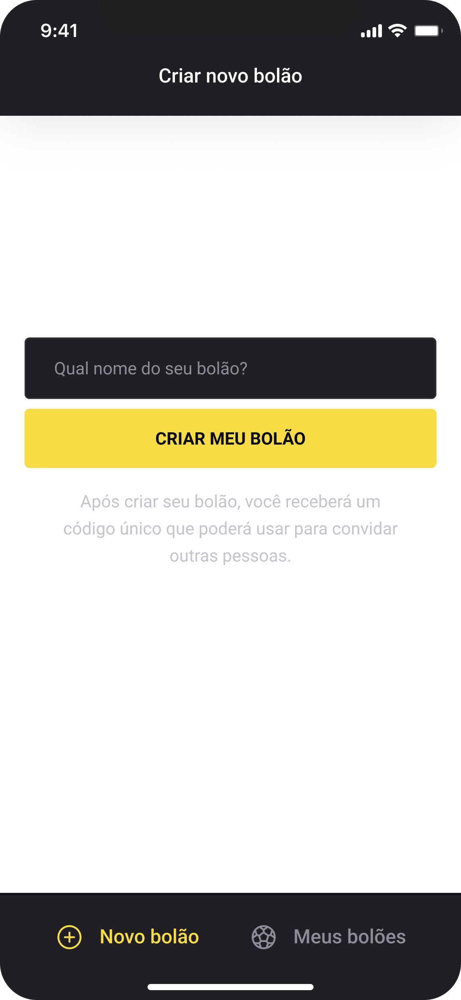

## NLW-copa

  

  

## 📱 Projeto

Aplicação mobile para participar da Copa do Mundo 2022. Com criações de bolões e palpites.
>Trilha ignite da 10 Edição do Next Week Level

  

 

## ✨ Tecnologias

### Front-End
- Typescript
- ReactJs
- React Native
- Axios
- TailwindCSS
- Native Base

### Back-End
- Expo
- Fastify
- Prisma
- Typescript
- OAuth
- JWT

### 🎉 Para executar segue a documentação atráves de cada pasta.

---
Made with 💜 by [Luan Fernando](https://www.linkedin.com/in/luan-fernando/).

